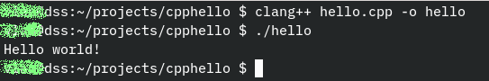

## cpphello
An object oriented `C++` version of a `"Hello World"`
that it should have been :)

### Compile and run
To make it working, just download `hello.cpp` and

compile it using your favorite compiler.

For example, at command prompt:
- using gcc:

    `g++ hello.cpp -o hello`

- using clang

    `clang++ hello.cpp -o hello`

This gives an executable `'hello'`

Then type `./hello`

Possible output:

_Hello world!_

### Screenshot

